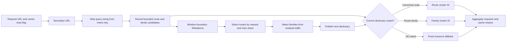

# clusterpath

`clusterpath` is a bounded-memory Go library for reducing URL cardinality before
indexing streams in ClickHouse or another analytics store. It learns structural
path and query patterns online and emits templates such as:

```text
/api/tag/entity_property_values/App%5CEntity%5CEdu%5CFormation/{id}
/resultat/candidat/{hex}.html
/etudes/annuaire-enseignement-superieur/formation/{slug}.html
```

## Properties

- One streaming pass for learning, with optional `Freeze` for stable replay.
- Fixed-size parsing scratch, cardinality sketches, and heavy-hitter tracking.
- Preallocated slab LRU with an open-addressed `uint64` index.
- Zero allocations in `Normalize` and `Apply` when the destination has capacity.
- Stateless masking for numeric IDs, long hexadecimal IDs, UUIDs, random tokens, and build fingerprints.
- Learned masking for high-cardinality literal path positions.
- Query-key sorting and typed high-cardinality value templates, plus a tracking denylist.
- Lock-free worker model through structural sharding.

## Library

```go
c := clusterpath.New(clusterpath.DefaultConfig())
dst := make([]byte, 0, 512)

dst = c.Normalize(dst[:0], rawURL) // learns and renders
c.Freeze()
dst = c.Apply(dst[:0], rawURL)     // stable, read-only bucket state
```

A `Clusterer` belongs to one goroutine. For parallel ETL, use `NewSharded`,
route each URL with `Shard`, and assign each result of `At(index)` to one worker.

## CLI

The default two-pass mode learns the input file, freezes decisions, and emits a
stable normalized stream:

```sh
go run ./cmd/clusterpath \
  -in example_data_let.paths \
  -out normalized.paths \
  -report clusters.tsv
```

For a non-seekable stream, use `-two-pass=false`.

## Performance

The API follows Go's append convention. The call itself remains allocation-free
when `dst` has enough capacity; growing a caller-provided destination naturally
allocates. Verify on the target machine with:

```sh
go test ./...
go test -run '^$' -bench . -benchmem
```

Measured on an ARM64 development machine, single core, validated over a
1-billion-operation streaming run against a synthetic high-cardinality corpus:

| Metric | Value |
|---|---|
| `Apply` (frozen, steady state) | ~185 ns/op, **0 allocs/op** |
| `Normalize` (learning) | ~212 ns/op, 0 allocs/op |
| Single-core throughput | **4.8 M ops/s** (~284 MB/s) |
| Parallel throughput (16 independent shards) | **58 M ops/s** (~3.5 GB/s) |
| Resident heap | bounded by `MaxBuckets` (about 6 KB per bucket, plus the index) |
| Allocations in the 1B hot loop | 0 |

Memory is bounded by `Config.MaxBuckets`. The default is 4,096 buckets; increase
it per worker when the workload contains many simultaneous structural shapes. If
the working set of distinct shapes exceeds `MaxBuckets`, buckets thrash (high
eviction count) and reduction quality drops — size it above the expected shape
count.

Because a `Clusterer` is allocation-free and single-goroutine, throughput scales
linearly across cores: run one independent `Clusterer` per worker (see
`NewSharded`) and route each URL with `Shard`.

## Budgeted metric clusters

`MetricClusterer` provides a tenant-scoped URL dimension with a hard upper
bound, suitable for aggregating request and cache-miss counters. It is separate
from the base `Clusterer`: URL normalization still learns precise templates, but
metrics emit a fixed, dashboard-safe number of cluster IDs.

The default budget is 96 IDs per tenant/site:

| IDs | Purpose |
|---:|---|
| 8 | Fixed `api`, `image`, `script`, `style`, `font`, `page`, `media`, and `other` fallbacks |
| 58 | Highest-impact canonical route templates |
| 30 | Deterministic host, first-path-segment, and resource-class families |

Route and family selection weights request share and absolute cache-miss share
equally. Active IDs receive a small promotion advantage so a new route must be
meaningfully more important before it displaces an existing cluster. Query
strings are never included in metric labels.

### Algorithm



Train and freeze the normalizer before recording metric observations. With this
immutable template model, `Rebalance` is the only operation that changes
assignments. Call it at a reporting-window boundary, persist the resulting
dictionary with its effective time, and then call `ResetWindow`. Cluster IDs
can be reused after a future rebalance, so historical dashboard queries must
resolve an ID using the dictionary that was active for the data's timestamp.

### CLI report

Generate a report from a URL file:

```sh
go run ./cmd/metriccluster -in urls.txt -out metric_clusters.tsv
```

The command reads the file three times: the first pass trains normalization,
the second selects the metric dictionary with that frozen model, and the third
assigns every URL and writes aggregate counts. The input must therefore be a
seekable regular file.

For URL-only input, every request is treated as a cache hit. For tab-separated
input containing a cache-miss flag (`0`/`1`, `hit`/`miss`, or `false`/`true`),
pass its zero-based column number:

```sh
go run ./cmd/metriccluster \
  -in requests.tsv \
  -cache-miss-column 1 \
  -out metric_clusters.tsv
```

`metric_clusters.tsv` is sorted by request volume and contains:

```text
cluster_id  kind      requests  cache_misses  cache_miss_rate  label
8           route     12345     42            0.003402         route:https://example.test/offer/buy/{id}/{slug}.html
66          family    987       5             0.005066         example.test/static/script
1           fallback  456       8             0.017544         other/image
```

The CLI accepts `-max-clusters`, `-exact-clusters`, `-max-candidates`, and
`-min-samples` when the default budget is not appropriate.

### Library usage

Train from a representative history before serving live events so the initial
dictionary is useful rather than fallback-heavy:

```go
m := clusterpath.NewMetricClusterer(clusterpath.MetricConfig{MaxClusters: 96})

for _, event := range historicalEvents {
    m.Train([]byte(event.URL))
}
m.FreezeNormalizer()
for _, event := range historicalEvents {
    m.Observe([]byte(event.URL), event.CacheMiss)
}
m.Rebalance()
dictionaryStore.Save(tenantID, time.Now(), m.Clusters())
m.ResetWindow()
```

For every live event, write additive counters keyed by tenant, time bucket, and
the returned ID:

```go
cluster := m.Observe([]byte(event.URL), event.CacheMiss)
misses := uint64(0)
if event.CacheMiss {
    misses = 1
}
metricStore.Add(event.Timestamp, tenantID, cluster.ID, 1, misses)
```

At the end of each reporting window, flush the current metrics before replacing
the dictionary:

```go
metricStore.Flush()
m.Rebalance()
dictionaryStore.Save(tenantID, time.Now(), m.Clusters())
m.ResetWindow()
```

Use `Assign` to replay URLs against the current dictionary without changing
selection counters:

```go
cluster := m.Assign([]byte(event.URL))
```

Calculate cache-miss rate from aggregate counters, never from an average of
per-request rates: `sum(cache_misses) / sum(requests)`. A `MetricClusterer`
belongs to one goroutine; run one per tenant or serialize access to a shared
tenant dictionary.

## Tuning cardinality reduction

Three knobs control how aggressively templates collapse. Fewer clusters is not
automatically better: over-masking destroys useful taxonomy (a section name
turned into `{slug}`). The goal is to mask near-unique *leaves* while keeping
bounded *enums* literal.

- **`SignaturePrefix` / `GroupByShape`** — the highest-impact lever. By default
  the first path segment is folded into the bucket key, which splits the long
  tail into many tiny per-section buckets that never reach `MinSamples`. Setting
  `SignaturePrefix: clusterpath.GroupByShape` buckets purely by structural shape,
  aggregating samples across sections so rare families still learn. It also uses
  fewer buckets. The trade-off: unrelated families that share a shape pool their
  per-position stats, so keep `HighCardRatio` high to avoid masking their
  category segments.
- **`MinSamples`** — lower it (e.g. 8) so small families collapse sooner.
- **`HighCardRatio`** — raise it (e.g. 0.8) so only near-unique positions are
  masked. Bounded-enum positions (sections, categories, API resources) have a
  low distinct/total ratio and stay literal; leaf slugs/IDs approach 1.0 and are
  masked. At billion-scale this happens naturally: enums accumulate huge counts
  so their ratio collapses toward zero.

Measured on the 3,364-path sample (`example_data_let.paths`):

| Settings | Clusters | Notes |
|---|---|---|
| defaults (`prefix=1, min=32, ratio=0.5`) | 350 | sections kept, article leaves stay one-per-URL |
| `GroupByShape, min=32, ratio=0.5` | 240 | same thresholds, more samples per bucket |
| `GroupByShape, min=8, dl=48, ratio=0.8` | 259 | leaves collapse **and** section taxonomy preserved |
| `GroupByShape, min=8, dl=32, ratio=0.5` | 192 | fewest, but over-masks (`/etudes/{slug}/{slug}.html`) |

Recommended starting point for maximum safe reduction:

```go
clusterpath.Config{
    SignaturePrefix: clusterpath.GroupByShape,
    MinSamples:      8,
    DistinctLimit:   48,
    HighCardRatio:   0.8,
}
```

The same knobs are exposed on the CLI:

```sh
go run ./cmd/clusterpath -in example_data_let.paths -report clusters.tsv \
  -signature-prefix -1 -min-samples 8 -distinct-limit 48 -high-card-ratio 0.8
```

The remaining low-count clusters are mostly a small-sample artifact: a section
seen once or twice here cannot be learned, but on a real high-volume stream every
section accumulates thousands of hits and collapses automatically.
